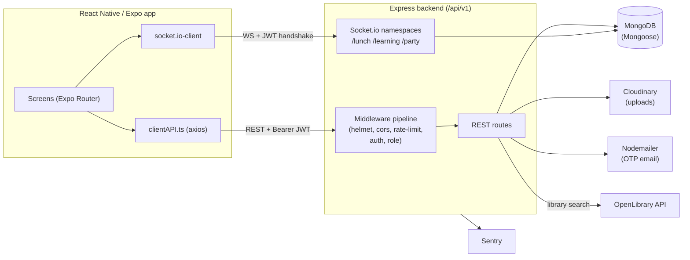
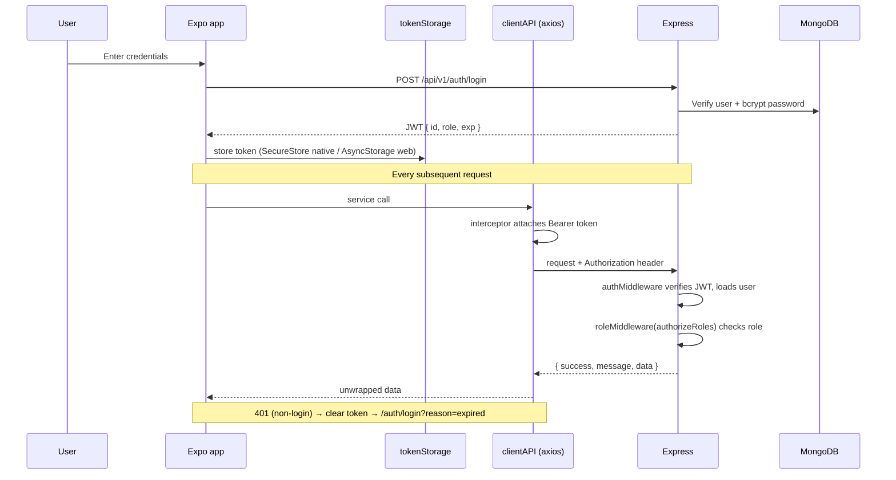

# Smart Campus — Technical Documentation

> A university management platform for **students, faculty, and administrators**.
> Node.js/Express + MongoDB backend, React Native/Expo frontend, REST + Socket.io.

This document is the single onboarding reference for the system. It describes how the
codebase is structured, how the pieces fit together, and the current state of the project.
It complements `CLAUDE.md` (AI-assistant guidance) and the internal `notes/` audit logs.

*Last verified against the codebase: 2026-07-16.*

---

## Table of Contents

1. [Overview](#1-overview)
2. [Tech Stack](#2-tech-stack)
3. [System Architecture](#3-system-architecture)
4. [Repository Structure](#4-repository-structure)
5. [Backend](#5-backend)
   - [Server bootstrap & middleware pipeline](#51-server-bootstrap--middleware-pipeline)
   - [Configuration](#52-configuration)
   - [Middleware](#53-middleware)
   - [Data models](#54-data-models)
   - [REST API reference](#55-rest-api-reference)
   - [Real-time (Socket.io)](#56-real-time-socketio)
   - [Security posture](#57-security-posture)
6. [Frontend](#6-frontend)
   - [Routing](#61-routing)
   - [Startup token flow](#62-startup-token-flow)
   - [State management](#63-state-management)
   - [Design system & theming](#64-design-system--theming)
   - [API layer & services](#65-api-layer--services)
   - [Hooks & cross-cutting UI](#66-hooks--cross-cutting-ui)
7. [Authentication & Authorization](#7-authentication--authorization)
8. [Environment Variables](#8-environment-variables)
9. [Setup & Running](#9-setup--running)
10. [Known Gaps, Limitations & Hardening Backlog](#10-known-gaps-limitations--hardening-backlog)

---

## 1. Overview

Smart Campus is a role-based campus management system with three user roles — **admin**,
**faculty**, and **student**. A single React Native/Expo app serves all three; the backend
issues a JWT whose `role` claim drives both navigation (frontend route groups) and access
control (backend middleware).

**Core capabilities**

| Domain | Admin | Faculty | Student |
|---|---|---|---|
| User management | Create faculty, list/edit/disable users | — | — |
| Courses | Create, assign faculty, delete (cascade) | View assigned courses | — |
| Enrollment | Enroll/unenroll students | — | View enrolled courses |
| Scheduling | Create/assign class schedules | View teaching schedule | View class schedule |
| Assignments | — | Create, review submissions, grade | View, submit (file upload) |
| Grades | — | Enter/update grades (0–6) | View grades (paginated) |
| Attendance | — | Mark attendance | View attendance summary |
| Notifications | Broadcast/targeted | Receive | Receive |
| Buddy chats | — | — | Real-time lunch / learning / party chat |
| Library | — | — | Search books (OpenLibrary proxy) |

Auxiliary/stub screens also exist for Exam, Create Meeting, Building Map, and a Chatbot
(see [§10](#10-known-gaps-limitations--hardening-backlog)).

---

## 2. Tech Stack

### Backend (`/backend`) — CommonJS, Node.js

| Package | Version | Role |
|---|---|---|
| express | ^5.2.1 | HTTP framework (Express **5** — async errors auto-forward) |
| mongoose | ^9.1.6 | MongoDB ODM |
| socket.io | ^4.8.3 | Real-time buddy chat namespaces |
| jsonwebtoken | ^9.0.3 | JWT sign/verify |
| bcryptjs | ^3.0.3 | Password & OTP hashing |
| helmet | ^8.1.0 | Security headers |
| cors | ^2.8.6 | CORS policy |
| express-rate-limit | ^8.3.2 | Rate limiting |
| express-validator | ^7.3.2 | Request validation |
| compression | ^1.8.1 | gzip responses |
| morgan | ^1.10.1 | HTTP request logging |
| multer | ^2.1.1 | Multipart upload parsing |
| cloudinary | ^2.9.0 | File/image storage |
| nodemailer | ^8.0.4 | OTP email delivery |
| xss | ^1.0.15 | Sanitize inbound chat messages |
| @sentry/node | ^10.49.0 | Error monitoring (opt-in via `SENTRY_DSN`) |
| swagger-jsdoc / swagger-ui-express | ^6.2.8 / ^5.0.1 | OpenAPI docs at `/api/docs` (dev only) |

### Frontend (`/frontend`) — TypeScript, Expo

| Package | Version | Role |
|---|---|---|
| expo | ~54.0.33 | Expo SDK |
| react-native | 0.81.5 | Native runtime |
| react / react-dom | 19.1.0 | UI library |
| expo-router | ~6.0.23 | File-based routing |
| nativewind + tailwindcss | ^4.2.2 / ^3.4.19 | Tailwind styling in RN |
| zustand | ^5.0.12 | Client state stores |
| @tanstack/react-query | ^5.99.0 | Server-state cache |
| axios | ^1.13.5 | HTTP client |
| socket.io-client | ^4.8.3 | Buddy chat sockets |
| jwt-decode | ^4.0.0 | Decode JWT role/exp client-side |
| @react-native-async-storage/async-storage | ^2.2.0 | Web token storage / cache |
| expo-secure-store | ~15.0.8 | Secure token storage (native) |
| @react-native-community/netinfo | ^12.0.1 | Offline detection |
| expo-image-picker / expo-document-picker | ~17 / ^55 | Profile image & submission upload |
| react-native-toast-message | ^2.3.3 | Toasts |
| expo-linear-gradient | ~15.0.8 | Gradient headers |

---

## 3. System Architecture



- **Transport:** REST over HTTPS for CRUD; Socket.io (WebSocket) for buddy chats.
- **API versioning:** every route is mounted under `/api/v1`.
- **Response envelope:** the backend wraps all JSON as `{ success, message, data }`; the
  frontend axios interceptor unwraps it transparently, so services see `data` directly.

---

## 4. Repository Structure

```
Smart_Campus_Batbold/
├── CLAUDE.md                  # AI-assistant project guidance
├── documentation.md          # ← this file
├── notes/                    # Internal audit & change logs
│   ├── audit.md
│   └── fix_logs.md
├── backend/
│   ├── server.js             # App bootstrap, middleware, route mounting, sockets
│   ├── config/
│   │   ├── db.js             # Mongo connect + retry/backoff
│   │   ├── cloudinary.js     # Upload config (guarded by hasCloudinaryConfig)
│   │   ├── swagger.js        # OpenAPI spec
│   │   └── academicHierarchy.js
│   ├── middleware/
│   │   ├── authMiddleware.js  roleMiddleware.js  errorHandler.js
│   │   ├── validate.js  socketAuth.js  socketRateLimit.js
│   │   ├── rateLimiters.js    # all HTTP limiters + trust-proxy config
│   ├── models/
│   │   ├── adminModels/       # user, course, enrollment, notification, schedule, studentSchedule
│   │   ├── facultyModels/     # assignment, assignmentSubmission, attendance, grade
│   │   └── studentModels/     # lunch/learning/party buddy messages
│   ├── routes/
│   │   ├── authRoutes.js  protectedRoutes.js  courseRoutes.js  notificationRoutes.js
│   │   ├── adminRoutes/  facultyRoutes/  studentRoutes/
│   ├── socket/
│   │   ├── buddySocketHandler.js  # createBuddyNamespace() factory
│   │   └── lunch/learning/partyBuddySocket.js  # thin wrappers
│   └── utils/dateUtils.js
└── frontend/
    ├── app/                  # Expo Router screens
    │   ├── index.tsx  _layout.tsx  auth/  admin/  faculty/  student/
    ├── components/           # ui/ design system + shared shells + admin/ student/
    ├── config/clientAPI.ts   # axios instance (interceptors)
    ├── contexts/             # AuthContext, ThemeContext
    ├── store/                # Zustand: user, notifications, schedule
    ├── hooks/                # auth guard, buddy socket, network, responsive
    ├── services/             # domain API modules (all call clientAPI)
    ├── styles/tokens.js      # single source of truth for colors
    ├── types/api.ts          # shared TypeScript API interfaces
    ├── utils/logger.ts       # dev-only logger
    ├── app.json  eas.json    # Expo + EAS build config
```

---

## 5. Backend

### 5.1 Server bootstrap & middleware pipeline

`server.js` wires everything in a deliberate order (`server.js:1`–`237`):

1. **`dotenv.config()`** then a **fail-fast JWT guard** — exits if `JWT_SECRET` is missing or `< 32` chars (`server.js:4`).
2. **Sentry init** — only when `SENTRY_DSN` is set (`server.js:10`).
3. **`compression()`** → **`morgan()`** (`combined` in prod, `dev` otherwise) → **request-id** middleware assigning `req.id = crypto.randomUUID()` (`server.js:34`).
4. **`connectDB()`** kicks off the Mongo connection with retry/backoff.
5. **`app.set("trust proxy", TRUST_PROXY_HOPS)`** — default `0` (no proxy trusted, so `X-Forwarded-For` is ignored and cannot be forged). Logs a warning at boot if `NODE_ENV=production` while still `0`.
6. **HTTPS redirect** (production only) keyed on `x-forwarded-proto`.
7. **CORS origin list** parsed from `ALLOWED_ORIGINS`; insecure `http://` origins are dropped in production.
8. **`helmet()`** — `frameguard: deny`, HSTS (1 year, prod only), `crossOriginResourcePolicy: cross-origin`, `referrerPolicy: strict-origin-when-cross-origin`.
9. **`cors()`** — `maxAge: 86400`, credentials, restricted methods.
10. **Body parsers** — JSON + urlencoded, `10mb` limit for base64 image uploads.
11. **Envelope `res.json` override** — wraps every response as `{ success, message, data }`.
12. **Rate limiters** — imported from `middleware/rateLimiters.js`: `authLimiter` (IP-keyed, 15/window) on `/auth`; `apiLimiter` (`RATE_LIMIT_MAX`, default 600) on **every** data route; `libraryLimiter` (`LIBRARY_RATE_LIMIT_MAX`, default 30) stacked on top for `/library`. `otpLimiter` (email-keyed) is applied inside `authRoutes.js`. `apiLimiter` and `libraryLimiter` key on **user id** decoded from the JWT, falling back to `ipKeyGenerator(req.ip)` when unauthenticated.
13. **Route mounting** under `/api/v1/*`.
14. **Swagger UI** at `/api/docs` — **non-production only**.
15. **Health endpoints** — `GET /health` (liveness) and `GET /ready` (503 until Mongo `readyState === 1`).
16. **Global error handler** (Sentry capture for 5xx).
17. **Socket.io** namespaces registered; **SIGTERM/SIGINT** graceful shutdown.

### 5.2 Configuration

| File | Responsibility |
|---|---|
| `config/db.js` | Mongoose connection using `MONGO_URI`; exponential-backoff retry (up to 5), `process.exit(1)` only after max retries. |
| `config/cloudinary.js` | Cloudinary SDK config; every call site is guarded by `hasCloudinaryConfig()` so the app runs without credentials. |
| `config/swagger.js` | OpenAPI/Swagger spec (auth, profile, course routes documented via JSDoc). |
| `config/academicHierarchy.js` | Static schools → departments → programs hierarchy used for user academic fields. |

### 5.3 Middleware

| File | Responsibility |
|---|---|
| `authMiddleware.js` | Verifies JWT (`Authorization: Bearer`), loads user (`isActive`, `role`), attaches `req.user`. |
| `roleMiddleware.js` | Exports a factory `(...roles) => (req,res,next)`; imported as `authorizeRoles` in route files. |
| `errorHandler.js` | Maps errors to safe HTTP codes (dup-key → 409, Mongo network/timeout/abort → 503, validation/cast → 400); Sentry capture for ≥ 500; 4xx `warn` / 5xx `error`. |
| `validate.js` | Runs `express-validator` results, returns first message + full `errors[]`. |
| `socketAuth.js` | `getTokenFromSocket()` reads only `handshake.auth.token` or the `Authorization` header (never query string). |
| `socketRateLimit.js` | Per-IP concurrent-connection cap (`SOCKET_MAX_CONN_PER_IP`, default 20). Per-user cap lives in the namespace factory (`SOCKET_MAX_CONN_PER_USER`, default 5). |
| `rateLimiters.js` | **All HTTP rate limiting in one place** — `authLimiter`, `apiLimiter`, `libraryLimiter`, `otpLimiter`, the shared `keyByUserOrIp` strategy, and `configureTrustProxy(app)`. Proxy trust is deliberately co-located with the limiters: setting it wrong silently breaks every bucket in the file (too low behind a proxy → one shared bucket for all users; `true` → forgeable `X-Forwarded-For`). |

### 5.4 Data models

**Admin models**

| Model | Key fields | Indexes / validators |
|---|---|---|
| `user` | name (≤100), email (unique, **sparse**, ≤255), password (bcrypt), role (`admin`/`faculty`/`student`), isActive, academic fields | indexes `{email:1}`, `{role:1}` |
| `course` | title, code (≤20), description, faculty ref | (`students[]` array exists but is unused — see §10) |
| `enrollment` | student ref, course ref | links students ↔ courses |
| `notification` | recipient ref, title (≤200), message (≤2000), isRead | compound `{recipient:1, isRead:1, createdAt:-1}` |
| `schedule` | course, faculty, day, startTime, endTime, room | `normalizeTime` pre-validate (`"9:00"`→`"09:00"`), `startTime < endTime`, unique `{course,faculty,day,startTime}`, index `{day,startTime}` |
| `studentSchedule` | student ref, schedule reference | student enrollment in a class schedule |

**Faculty models**

| Model | Key fields | Indexes / validators |
|---|---|---|
| `assignment` | course, faculty, title (≤200), description (≤2000), dueDate, maxPoints (default 100) | dueDate must be future **on create** |
| `assignmentSubmission` | assignment, student, Cloudinary file metadata, notes, score, feedback | — |
| `attendance` | student, course, date, schedule, status | date not in the future; unique `{student,course,date,schedule}` |
| `grade` | student, course, value | `value` 0–6; unique `{student,course}` |

**Student models** — `lunchBuddyMessage`, `learningBuddyMessage`, `partyBuddyMessage`:
identical shape (sender ref, text ≤400, timestamps; sender indexed).

### 5.5 REST API reference

All paths are prefixed with **`/api/v1`**. "Auth" = requires a valid JWT; "Role" = additional role gate.

**Auth** — `/auth` (rate-limited)

| Method | Path | Auth | Purpose |
|---|---|---|---|
| POST | `/auth/register` | — | Register a user |
| POST | `/auth/login` | — | Log in, returns JWT |
| POST | `/auth/forgot-password` | — | Request a 6-digit OTP by email (rate-limited) |
| POST | `/auth/reset-password` | — | Reset password with OTP |

**Profile / protected** — `/protected`

| Method | Path | Auth | Purpose |
|---|---|---|---|
| GET | `/protected/profile` | JWT | Current user's profile |
| PATCH | `/protected/profile/picture` | JWT | Update profile picture (Cloudinary) |
| GET | `/protected/admin`, `/protected/student` | Role | Role-gate smoke tests |

**Admin** — `/admin` (admin role)

| Method | Path | Purpose |
|---|---|---|
| GET | `/admin/academic-options` | Schools/departments/programs |
| POST | `/admin/create-faculty` | Create a faculty account |
| GET | `/admin/users` | List users (paginated) |
| PATCH | `/admin/users/:id` | Edit a user |
| DELETE | `/admin/users/:id` | Delete a user |
| PATCH | `/admin/users/:id/toggle` | Enable/disable a user |
| GET | `/admin/students` · `/admin/courses` | List students / courses |
| PUT | `/admin/courses/:courseId/assign` | Assign faculty to a course |
| POST | `/admin/enroll` | Enroll a student |
| GET | `/admin/enrollments` | List enrollments |
| DELETE | `/admin/enrollments/:id` | Unenroll (204) |
| POST | `/admin/notify` | Send a notification |
| GET | `/admin/schedules` | List schedules (paginated) |
| POST | `/admin/schedule` | Create a schedule |
| DELETE | `/admin/schedule/:id` · `/admin/schedule/unassign` | Delete / unassign schedule |
| POST | `/admin/assign-schedule` | Assign a schedule to a student |

**Courses** — `/courses`

| Method | Path | Role | Purpose |
|---|---|---|---|
| POST | `/courses` | admin | Create course |
| GET | `/courses` | admin | List courses |
| PATCH | `/courses/:id/assign` | admin | Assign faculty |
| DELETE | `/courses/:id` | admin | Delete course + **cascade** (enrollments, assignments, submissions + Cloudinary, grades, schedules) |
| GET | `/courses/my` | faculty | Courses I teach |

**Notifications** — `/notifications`

| Method | Path | Purpose |
|---|---|---|
| GET | `/notifications/unread-count` | Unread count for current user |
| GET | `/notifications` | List (paginated) |
| PATCH | `/notifications/:id/read` | Mark one as read *(see IDOR note in §10)* |

**Schedule** — `/schedule`

| Method | Path | Role | Purpose |
|---|---|---|---|
| GET | `/schedule/student` | JWT | Student's class schedule |
| GET | `/schedule/faculty` | faculty | Faculty teaching schedule |

**Grades** — `/grades`

| Method | Path | Role | Purpose |
|---|---|---|---|
| GET | `/grades/faculty/courses` | faculty | Courses for grading |
| GET | `/grades/faculty/courses/:courseId/students` | faculty | Students in a course |
| PUT | `/grades/faculty/courses/:courseId/students/:studentId` | faculty | Set/update a grade |
| GET | `/grades/student` | student | My grades (paginated) |

**Attendance** — `/attendance`

| Method | Path | Role | Purpose |
|---|---|---|---|
| GET | `/attendance/faculty/courses` | faculty | Courses |
| GET | `/attendance/faculty/courses/:courseId/students` | faculty | Roster |
| PUT | `/attendance/faculty/courses/:courseId/students/:studentId` | faculty | Mark attendance |
| GET | `/attendance/student/summary` | student | Attendance summary |
| GET | `/attendance/student/schedule` | student | Schedule for attendance view |

**Assignments** — `/assignments`

| Method | Path | Role | Purpose |
|---|---|---|---|
| GET | `/assignments/faculty/courses` | faculty | Courses |
| GET | `/assignments/faculty/courses/:courseId/assignments` | faculty | Assignments in a course |
| POST | `/assignments/faculty/courses/:courseId/assignments` | faculty | Create assignment |
| GET | `/assignments/faculty/courses/:courseId/assignments/:assignmentId/submissions` | faculty | Submissions |
| PUT | `/assignments/faculty/assignments/:assignmentId/submissions/:submissionId/review` | faculty | Review/grade a submission |
| DELETE | `/assignments/:assignmentId` | faculty | Delete assignment + Cloudinary cleanup |
| GET | `/assignments/submissions/:submissionId/download` | JWT | Download a submission (ownership-checked) |
| GET | `/assignments/student` | student | My assignments |
| POST | `/assignments/student/assignments/:assignmentId/submission` | student | Submit (file upload) |

**Library** — `/library`

| Method | Path | Auth | Purpose |
|---|---|---|---|
| GET | `/library/search` | JWT | Book search (OpenLibrary proxy, timeout + retry) |

**Buddy messages** — `/lunch-buddy`, `/learning-buddy`, `/party-buddy`

| Method | Path | Role | Purpose |
|---|---|---|---|
| GET | `/{buddy}/messages` | student | Chat history (cursor pagination `?before=<id>&limit=`) |

### 5.6 Real-time (Socket.io)

Three namespaces — `/lunch-buddy`, `/learning-buddy`, `/party-buddy` — are all produced by a
single factory, `createBuddyNamespace()` in `socket/buddySocketHandler.js`. Each of the three
socket files is a ~10-line wrapper that calls the factory with a namespace name.

Per namespace, the factory:
- **Authenticates** the handshake via `getTokenFromSocket()` and verifies the JWT.
- **Authorizes** — students only, and rejects disabled accounts.
- **Rate-limits** connections (per-IP globally via `socketRateLimit`, per-user within the namespace).
- **Sanitizes** every inbound message with `xss(text, { whiteList: {}, stripIgnoreTag: true })` before persisting/broadcasting.
- **Tracks presence** and broadcasts online participants.

### 5.7 Security posture

- **Transport:** HTTPS redirect in production; HSTS (1 year) via Helmet; `frameguard: deny`.
- **CORS:** explicit allow-list; insecure origins rejected in production.
- **JWT:** 32-char-minimum secret enforced at boot; expiry from `JWT_EXPIRES_IN` (default `7d`).
- **Passwords & OTP:** bcrypt-hashed; OTP compared with `bcrypt.compare`, never returned by the API, 15-minute expiry, send throttled.
- **Rate limiting:** every data route is throttled (`RATE_LIMIT_MAX`, default 600/15 min), with a tighter bucket on the outbound `/library` proxy (default 30). Authenticated traffic is keyed by **user id**, not IP — correct behind a reverse proxy and on shared campus NAT. `trust proxy` defaults to `0`, so `X-Forwarded-For` cannot be forged to reset a bucket.
- **Input:** `express-validator` on auth/admin routes; password complexity (≥8, upper/digit/special); XSS sanitization on chat.
- **Uploads:** 10 MB body cap; Cloudinary access guarded.
- **Monitoring:** Sentry captures 5xx.

See [§10](#10-known-gaps-limitations--hardening-backlog) for open hardening items.

---

## 6. Frontend

### 6.1 Routing

Expo Router (file-based). `app/_layout.tsx` is the root Stack, wrapping the tree in
`ThemeProvider`, `AuthProvider`, `QueryClientProvider` (TanStack Query, staleTime 30s), an
`ErrorBoundary`, an `OfflineBanner`, and a global `Toast` host. Screens are grouped by role:
`app/admin/`, `app/faculty/`, `app/student/`, plus `app/auth/` (login, register, forgot/reset
password).

### 6.2 Startup token flow

`app/index.tsx` is the entry screen. `resolveTokenRoute()` reads the stored JWT, checks
expiry, and returns the correct dashboard route (or `/auth/login`). It runs on cold start and
again whenever the app returns to the foreground (`AppState` "active" listener).
*(A navigation race between these two paths is a known open item — see §10.)*

### 6.3 State management

| Layer | Where | What |
|---|---|---|
| Auth | `contexts/AuthContext.tsx` | `useAuth()` → `{ user, refreshUser, signOut }`; `user` is the decoded JWT (`id`, `role`, `exp`). |
| Theme | `contexts/ThemeContext.tsx` | `useTheme()` → `{ isDark, t, toggleTheme }`. |
| Client state | `store/` (Zustand) | `useUserStore` (profile), `useNotificationStore` (unread count), `useScheduleStore` (today's schedule). |
| Server state | TanStack Query | Configured in `app/_layout.tsx` (`staleTime` 30 s, `gcTime` 5 min, `retry` 2, `refetchOnWindowFocus: false`) but **adopted by only 3 screens** — `admin/notifications`, `student/assignments`, `student/notifications`. Roughly 18 other data screens still fetch by hand in `useEffect`. See the caching note in [§10](#10-known-gaps-limitations--hardening-backlog). |

### 6.4 Design system & theming

- **`components/ui/`** — `AppButton`, `AppInput`, `AppCard`, `AppBadge`, `AppModal`,
  `AppAvatar`, `AppSectionHeader`. Prefer these over one-off styled elements.
- **`styles/tokens.js`** — the single source of truth for color; a custom ESLint rule
  (`eslint-rules/no-hardcoded-tw-colors.js`) warns on raw Tailwind color classes.
- **Shared shells** — `DashboardTemplate`, `SharedProfileScreen`, `ScreenLayout` keep the
  three role dashboards/profiles thin; `LiveClock`, `OfflineBanner`, `ErrorBoundary` are
  cross-cutting.

### 6.5 API layer & services

- **`config/clientAPI.ts`** — the one axios instance. A request interceptor attaches
  `Authorization: Bearer <token>` and strips `Content-Type` for `FormData`. A response
  interceptor **unwraps the `{success,message,data}` envelope**, attaches a `friendlyMessage`
  (403/404/5xx), and on a non-login **401** clears the token and redirects to
  `/auth/login?reason=expired`. `baseURL` is `${EXPO_PUBLIC_API_URL}/api/v1`.
- **`services/`** — one module per domain (auth, course, user, notification, schedule, plus
  admin/faculty/student sub-folders). All API logic lives here and goes through `clientAPI` —
  no raw `fetch`/`axios` elsewhere (the one `fetch` in `AssignmentCard.tsx` reads a local file
  URI into a Blob for upload, not an API call).

### 6.6 Hooks & cross-cutting UI

| Hook | Purpose |
|---|---|
| `useAuthGuard` | Redirects on missing/expired token or role mismatch. |
| `useBuddySocket` + `useLunchBuddy`/`useLearningBuddy`/`usePartyBuddy` | Full socket lifecycle in one generic hook; three thin wrappers. Sockets use `reconnectionAttempts: 5`. |
| `useNetworkStatus` | `isOnline`/`justReconnected` via NetInfo; powers the offline banner. |
| `useResponsive` | Breakpoint derivation from window dimensions. |

`utils/logger.ts` gates all `console.*` behind `__DEV__` (no unguarded logging elsewhere).

---

## 7. Authentication & Authorization



**Password reset (OTP):** `POST /auth/forgot-password` emails a 6-digit OTP (bcrypt-hashed,
15-min expiry, never returned in the response, send-rate limited) → `POST /auth/reset-password`
validates the OTP with `bcrypt.compare` and sets a new password (complexity enforced).

---

## 8. Environment Variables

**Backend `.env`** (git-ignored):

```
PORT=5000
MONGO_URI=
JWT_SECRET=                 # ≥ 32 chars, or the server refuses to boot
JWT_EXPIRES_IN=7d           # optional
CLOUDINARY_CLOUD_NAME=
CLOUDINARY_API_KEY=
CLOUDINARY_API_SECRET=
EMAIL_SERVICE=gmail
EMAIL_USER=
EMAIL_PASS=
ALLOWED_ORIGINS=http://localhost:3000,http://localhost:8081
SENTRY_DSN=
# Optional tuning: RATE_LIMIT_WINDOW_MS, RATE_LIMIT_MAX, LIBRARY_RATE_LIMIT_MAX,
# MAX_UPLOAD_BYTES, OPEN_LIBRARY_TIMEOUT_MS, RESET_TOKEN_TTL_MINUTES,
# SOCKET_MAX_CONN_PER_USER, SOCKET_MAX_CONN_PER_IP
# TRUST_PROXY_HOPS=0   # set to 1 when deploying behind nginx / a load balancer
```

**Frontend `.env`**:

```
EXPO_PUBLIC_API_URL=http://<backend-host>:5000
```

> On a physical device, set `EXPO_PUBLIC_API_URL` to your machine's LAN IP
> (e.g. `http://192.168.x.x:5000`), **not** `localhost`.

---

## 9. Setup & Running

**Backend** (requires MongoDB + a `.env`):

```bash
cd backend
npm install
node server.js          # serves on PORT (default 5000)
```

**Frontend:**

```bash
cd frontend
npm install
npm start               # Expo dev server
npm run web             # browser
npm run android         # Android emulator/device
npm run ios             # iOS simulator/device
npm run lint            # ESLint
```

**Builds (EAS)** — `eas.json` defines two Android profiles: `preview` (APK) and
`production` (app-bundle). Run `eas init` first to provision a `projectId`/`owner` (not yet
present — see §10). No `development` or iOS profile is configured.

> No automated test suite exists yet (backend or frontend).

---

## 10. Known Gaps, Limitations & Hardening Backlog

This section reflects the **current, verified state** of the code as of the date above.
It supersedes any conflicting status in `notes/audit.md`.

### Unimplemented / stub features (frontend screen exists, no real backend)

| Feature | State |
|---|---|
| Exam | "Coming soon" stub, advertised on the faculty dashboard |
| Create Meeting | "Coming soon" stub, advertised on the student dashboard `could implement team_projects whiteboard project` |
| Building Map | Static bundled images; no data endpoint |
| Chatbot | Client-side FAQ matcher over `services/faq.json` (not AI) |
| Push notifications | Not wired (no APNS/FCM) |
| Real-time grade/attendance updates | Sockets exist only for buddy chat |

### Hardening backlog (verified issues to address)

> **Resolved 2026-07-16** (frontend UI/UX & theming pass — see `notes/fix_logs.md`): theme now persists (#7 below); the campus map fits on phones and gained pinch/pan/double-tap zoom; destructive-delete confirmations, `alert()`→`Toast`, 18 mojibake `•` fixes, a broken dropdown glyph, and removal of a dead `admin/schedule` stub; auth `Alert`→inline. The app was also recoloured to an "Ocean Teal" scheme (blue→teal primary, purple→deep-teal dark).
>
> **Also resolved 2026-07-16** (runtime bug hunt — `notes/audit.md` items 30–32): two **silent 500s
> that broke whole features** — the Mongoose 9 upgrade removed callback-style middleware, so the
> `schedule.js` `pre("validate")` hook threw and **schedule creation was 100% broken**; and
> `session.withTransaction()` cannot run on standalone Mongo, so **assignment creation was 100%
> broken**. Also fixed: assignment review silently awarding a **0** to ungraded students
> (audit #22 — **runtime-verified** through the UI against the live DB), missing error/retry states
> on the student attendance & assignments screens, and a web file picker that only worked on the
> second click (`await import()` inside a press handler).
>
> ⚠️ **Known-broken, still open:** `faculty/assignments.tsx` uses `Alert.alert` for its delete
> confirmation, which is a **no-op on react-native-web** — faculty cannot delete assignments on web.

| # | Area | Detail | Location |
|---|---|---|---|
| 1 | ✅ **Broken access control (IDOR) — resolved 2026-07-19** | Mark-as-read is now scoped to the owner via `findOneAndUpdate({ _id, recipient: req.user.id }, …)`, returning 404 on a miss. Runtime-verified against the live DB (attacker 404 + victim row untouched; baseline confirmed the old code returned 200 and flipped the row). A sweep of all 18 route files found **no other IDOR** — see `notes/audit.md` → "IDOR Sweep". | `routes/notificationRoutes.js:54` |
| 2 | **Token in query string** | `authMiddleware` accepts `?token=`, leaking the JWT into access/proxy logs and browser history. ⚠️ **Corrected 2026-07-19:** the earlier "nothing uses it — safe to remove" note was **wrong**. `getAssignmentSubmissionDownloadUrl` puts the full session JWT in the URL and both assignment screens use it on the **native** path (`Linking.openURL` cannot send headers), so this fires on every native download and **cannot be removed without a replacement auth path**. Options in `notes/audit.md` item 18. | `middleware/authMiddleware.js:6,12`, `services/facultyServices/assignmentService.ts:151` |
| 3 | ✅ **Rate limiting gap — resolved 2026-07-19** | `apiLimiter` now guards all 14 previously-unthrottled data route mounts, and the outbound `/library/search` proxy gets its own tighter bucket (`libraryLimiter`). Runtime-verified. | `server.js` |
| 4 | ✅ **No `trust proxy` — resolved 2026-07-19** | `app.set("trust proxy", TRUST_PROXY_HOPS)` (default **0**, never `true`). More importantly, authenticated traffic is now keyed by **user id** rather than IP, so limits stay correct behind a proxy and on shared campus NAT. Verified that a forged `X-Forwarded-For` cannot reset a bucket. | `server.js` |
| 5 | ✅ **User delete doesn't cascade — resolved 2026-07-19** | Now **role-aware**, deliberately not a mirror of the course cascade. Students cascade across all 9 related collections (+ Cloudinary cleanup); faculty who still own courses/schedules/assignments are refused with **409** rather than having their courses deleted, which would destroy enrolled students' grades and submissions. Runtime-verified 11/11. ⚠️ **164 orphan rows from pre-fix deletes remain in the DB** (reported, not cleaned — 2 orphaned assignments still have live submissions attached, so blind cleanup is unsafe). | `routes/adminRoutes/adminRoutes.js:169` |
| 6 | **Startup navigation race (Bug 9)** | Cold-start and the AppState-active listener can both call `router.replace()`. Fix: an `isNavigating` guard ref. | `app/index.tsx:41,50` |
| 7 | ✅ **Theme not persisted — resolved 2026-07-16** | Now persisted to AsyncStorage; hydrates from saved pref → OS scheme → dark. | `contexts/ThemeContext.tsx` |
| 8 | **`logger.error` swallowed in prod** | Errors are `__DEV__`-gated, so nothing surfaces in production and no crash reporter is wired on the client. | `utils/logger.ts` |
| 9 | **`: any` still widespread** | **77 occurrences across 32 files** (`useState<any[]>`, `catch (err: any)`, `router.push(x as any)`); `types/api.ts` exists but is under-adopted. *(Corrects the notes' "zero any" claim.)* | frontend-wide |
| 10 | **EAS not provisioned** | No `projectId`/`owner`; `eas build` fails until `eas init` runs. | `eas.json` / `app.json` |
| 11 | **Dead code** | `course.students[]` is never written; `config/http.ts` is an empty file. | `models/adminModels/course.js`, `frontend/config/http.ts` |
| 12 | **No test suite** | Neither backend nor frontend has a test framework. | repo-wide |

### Caching — audit note, 2026-07-19 (nothing implemented)

Findings from a caching review. **No code was changed**; recorded so the next pass has the
analysis rather than re-deriving it.

**Measured, not assumed:** ETag/304 revalidation already works, but a `304` takes the *same* time
as a `200` (~5.7 ms vs ~5.9 ms) and the route handler still runs — Express computes the ETag from
the response body, so the Mongo query has already happened. **HTTP caching saves client bandwidth,
never server load.**

| Target | Verdict |
|---|---|
| **Buddy chat — cursor pages** | ⭐ **The one real win.** `GET /{buddy}/messages?before=<id>` is **immutable by construction**: the socket only handles `message:send`, there is no edit or delete, and the sole mutation is the user-delete cascade (item 21). Same request → same result, forever. Scrollback and screen re-entry currently refetch these pages from Mongo every time. |
| **Buddy chat — first page** | ❌ Never cache. Changes on every message, and the socket already pushes `message:new`, so caching would fight it. |
| **Building map** | ✅ **No action — nothing to cache.** Floor plans are `require()`'d into the bundle (296 KB total, 7 files); the screen makes **zero** network calls. No header could affect it. |
| **`GET /admin/academic-options`** | Returns `config/academicHierarchy.js` verbatim — identical for every user, changes only on deploy. The one clean `max-age` candidate. |
| **`GET /library/search`** | Deterministic per query, hits a third party. Wants a **server-side** TTL cache, not headers. |
| Everything else (grades, attendance, notifications, submissions) | Per-user and volatile — not cacheable at any layer. |

**Recommendation — prefer TanStack Query over HTTP headers here.** `Cache-Control` is unreliable on
React Native: iOS honours it via `NSURLSession`'s shared `URLCache`, but Android's OkHttp in RN has
no disk cache enabled by default, so headers may do nothing on most devices. Web works properly.
A client-side cache is platform-independent and prevents the request entirely rather than making it
cheap.

Concretely: migrate `useBuddySocket`'s history fetch to `useQuery` keyed on the cursor with
`staleTime: Infinity` (safe — those pages never change), and adopt `useQuery` across the ~18 screens
still hand-rolling `useEffect` fetches. That is the actual performance work; HTTP caching is a
sideshow for this app.

### Missing `Cache-Control` — open security item, 2026-07-19

Separate from the performance question above. The backend sets **no `Cache-Control` anywhere**.
Authenticated responses return only `Vary: Origin, Accept-Encoding` + `ETag` — **`Vary` omits
`Authorization`**, so the cache key ignores who asked. RFC 9111 §3.5 stops a correctly-implemented
shared cache from storing responses to requests bearing `Authorization`, but CDNs configured to
cache by path routinely ignore that, and private browser caches store the JSON regardless — student
records persist on disk after logout on a shared machine. Now that `TRUST_PROXY_HOPS` exists in
anticipation of a reverse proxy, this becomes live surface.

Suggested fix: `no-store` on `/auth`, `private, no-cache` on data routes (preserves the working
304s), `Vary: Authorization`, and `private, max-age=3600` on `/admin/academic-options`.
*(Login is a POST, so the JWT is less exposed than the bare headers suggest — POST responses are not
cacheable without explicit freshness directives.)*

### Architectural notes (accepted / by design)

- **No MongoDB transactions anywhere** — the deployment runs **standalone** Mongo (verified: no
  replica set), which cannot start transactions at all. The last `withTransaction` block was
  removed on 2026-07-16 because it made assignment creation fail outright; multi-step writes now
  use a plain create plus a best-effort follow-up. Do not reintroduce sessions without a replica set.
- **Backend business logic lives in route handlers** — no dedicated service layer yet.
- **Socket.io presence is in-memory** — won't scale horizontally without Redis.
- **Backend still uses `console.*`** for operational logs (no structured logger).
```
